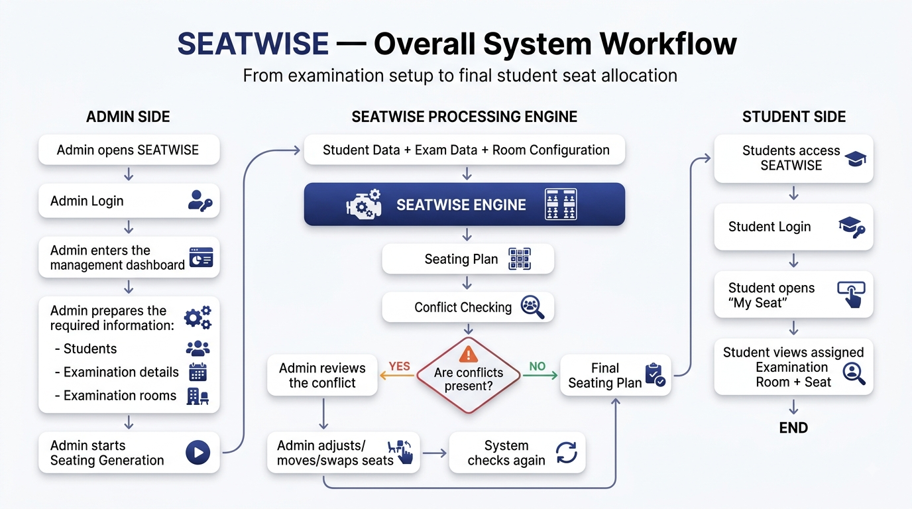
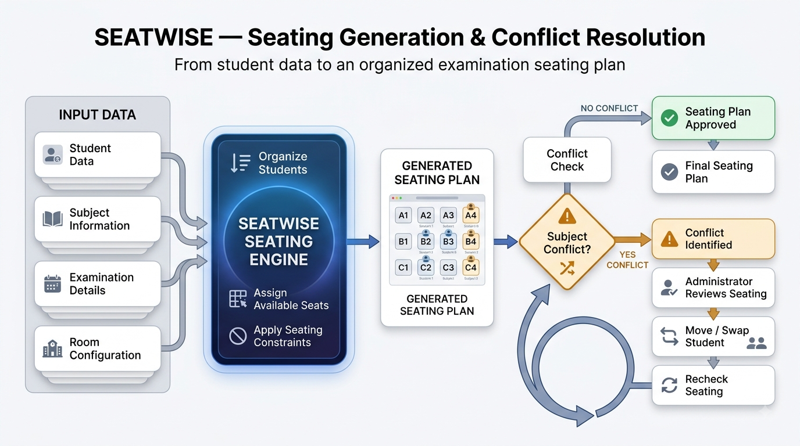
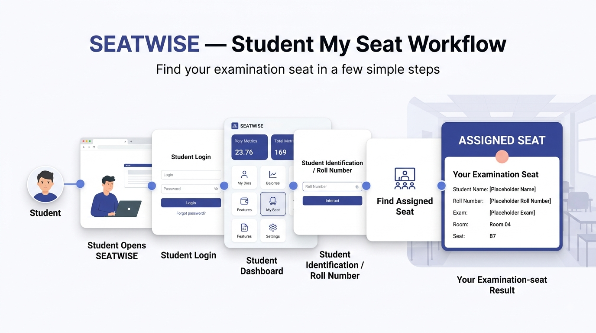

# SEATWISE — Dynamic Exam Seating & Conflict Resolver

**A web-based system for simplifying examination seating management and generating organized seating plans.**

---

## 1. About SEATWISE

**SEATWISE** is a BEE engineering project developed to simplify the process of managing examination seating arrangements.

It allows administrators to manage:

- Students
- Examinations
- Examination rooms
- Seating arrangements
- Seating conflicts

The system generates an organized seating plan based on the available student and room information.

Students can log in and use **My Seat** to find their assigned examination room and seat.

---

## 2. Problem Statement

Preparing examination seating arrangements manually can become difficult when there are:

- A large number of students
- Multiple subjects
- Several examination rooms
- Different room capacities
- Seating conflicts that need to be resolved

SEATWISE aims to reduce this manual effort by providing a centralized system for managing and organizing examination seating.

---

## 3. What Can SEATWISE Do?

### For Administrators

Administrators can:

- Manage students
- Manage users
- Manage examinations
- Configure examination rooms
- Generate seating arrangements
- View seating plans
- Identify seating conflicts
- Move or swap students
- Regenerate seating arrangements

### For Students

Students can:

- Create an account
- Log in to the system
- Access their account
- Use **My Seat**
- View their assigned examination room and seat

---

## 4. Basic Project Workflow

The overall SEATWISE workflow is:

**Admin Login**

↓

**Manage Students & Exams**

↓

**Configure Rooms**

↓

**Generate Seating**

↓

**Review Seating Plan**

↓

**Check & Resolve Conflicts**

↓

**Finalize Seating**

↓

**Student Checks My Seat**

### Project Workflow Flowchart

---

## 5. Seating Management

SEATWISE automatically generates seating arrangements using the available student and room information.

The system attempts to keep students from the **same subject** from being seated directly next to each other.

If a conflict is identified, the administrator can review the seating arrangement and make necessary adjustments.

The seating plan can then be checked again before it is finalized.

### Seating & Conflict Flowchart

---

## 6. Student Experience

After the seating plan has been prepared, students can log in and use **My Seat** to find their examination seat.

The student workflow is:

**Student Login**

↓

**My Seat**

↓

**View Assigned Room & Seat**

### Student Workflow Flowchart

---

## 7. Current Capacity

The current demonstration setup supports:

**10 Rooms × 50 Seats = 500 Seats**

Each room currently contains:

- 5 Rows
- 10 Columns
- 50 Seats

The room configuration can be modified according to examination requirements.

---

## 8. Technology Used

### Frontend

- HTML5
- CSS3
- Vanilla JavaScript
- ES6 Modules

### Additional Technologies

- LocalStorage for current data persistence
- GSAP for animations
- Lucide Icons for interface icons

---

## 9. Future Scope

SEATWISE is currently implemented using **Vanilla JavaScript and LocalStorage**.

The project can be further developed into a full MERN stack application using:

- React
- Node.js
- Express.js
- MongoDB

Possible future improvements include:

- Centralized database storage
- Backend authentication
- Advanced seating management
- Improved scalability
- Multi-user administration

---

## 10. Project Team

| Team Member | Role |
|-------------|------|
| Namya Gupta | Team Leader |
| Harnoor Buttar | Team Member |
| Sarthak Kanwar | Team Member |

The project is developed collaboratively through planning, development, testing, and integration.

---

## 11. Project Goal

The goal of **SEATWISE** is to provide a simple and organized solution for examination seating management.

It aims to:

- Reduce manual work for administrators
- Organize examination seating
- Identify seating conflicts
- Allow necessary seating adjustments
- Make seat information easily accessible to students

---

## SEATWISE

**Dynamic Exam Seating & Conflict Resolver**

***Generate smarter. Resolve conflicts. Seat better.***