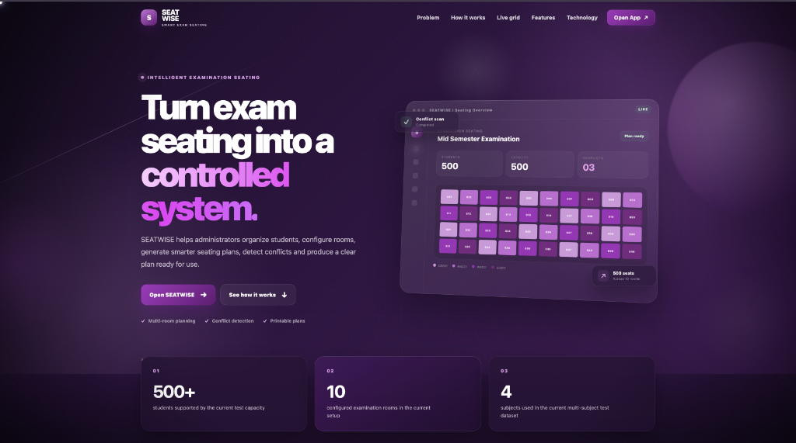
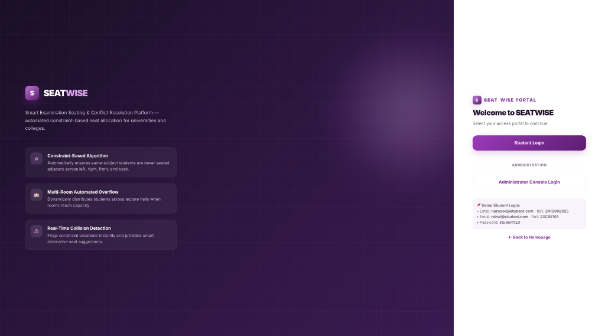
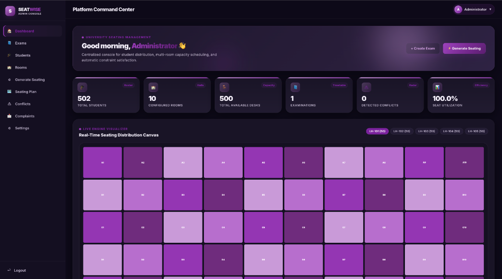
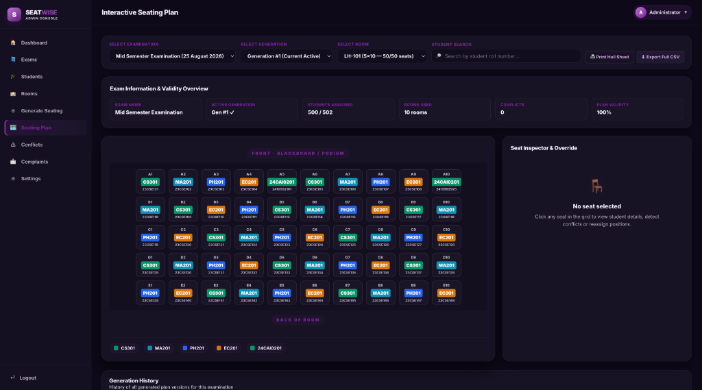
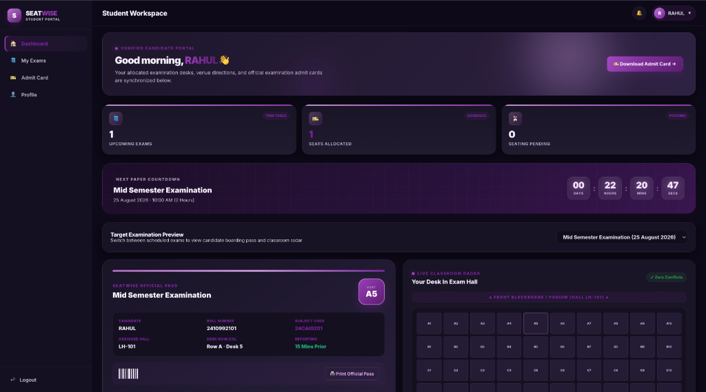
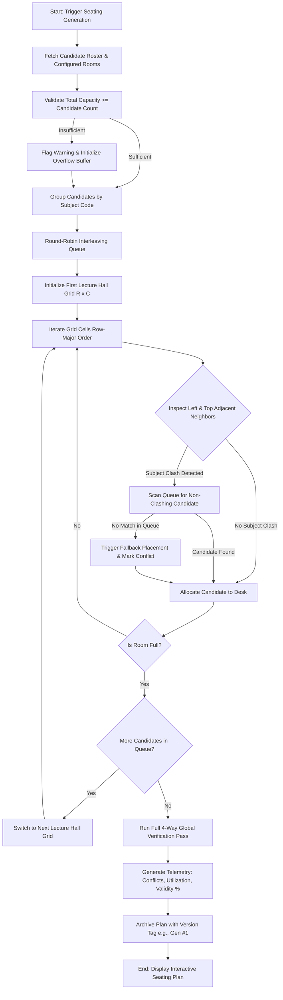
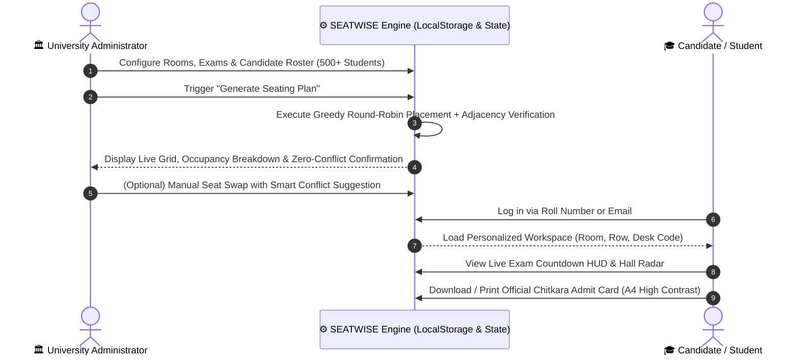

# 🎓 SEATWISE
### Intelligent Examination Seating Allocation & Real-Time Conflict Resolution Platform

<div align="center">



[](https://github.com/Harnoorkaur06/Seatwise)
[](https://github.com/Harnoorkaur06/Seatwise)
[](https://github.com/Harnoorkaur06/Seatwise)
[](https://github.com/Harnoorkaur06/Seatwise)
[](https://github.com/Harnoorkaur06/Seatwise)
[](https://github.com/Harnoorkaur06/Seatwise)

<p align="center">
  <b>An automated, constraint-driven examination seating platform that completely eliminates same-course student adjacencies across multi-hall university campuses.</b>
</p>

[✨ Live Demo](#-quick-start--demo-credentials) •
[📸 UI Showcase](#-interface-showcase--visual-tour) •
[🧩 Algorithm](#-the-seating-algorithm-core-academic-contribution) •
[📊 Flowcharts](#-system-architecture--engine-flowcharts) •
[⚙️ Features](#-key-platform-features) •
[🚀 Roadmap](#-phase-2-mern-stack-migration-path)

---

</div>

## 📌 Executive Summary

Examination seating arrangements in modern universities present a classic **NP-hard Constraint Satisfaction Problem (CSP)**. When hundreds of candidates from disparate disciplines (Computer Science, Mathematics, Physics, Electronics) are seated in shared lecture halls, manual seat allocation inevitably causes adjacent same-subject placements—increasing unfair academic exposure and logistical overhead.

**SEATWISE** transforms university exam administration with a deterministic, round-robin interleaving algorithm that guarantees:

> 🛡️ **The 4-Way Adjacency Rule:** No two students appearing for the same subject or course code are ever placed directly adjacent to each other (**Left**, **Right**, **Front**, or **Back**). Diagonal seating is intentionally permitted to maximize room capacity utilization.

---

## 📸 Interface Showcase & Visual Tour

### 1. Modern SaaS Landing Page
> *A high-converting, presentation-ready portal explaining platform value propositions, live seat distribution preview, and performance statistics.*

<div align="center">
  
</div>

* **Features:** Animated background blobs, live 500-seat simulation canvas, feature comparison matrix, and responsive cross-device navigation.

---

### 2. Multi-Role Unified Portal Login
> *Frictionless authentication switcher for University Administrators and Students with pre-seeded demo accounts.*

<div align="center">
  
</div>

* **Features:** Single-click demo credentials, persistent session control, role-based route gating, and custom student password onboarding.

---

### 3. Administrator Command Center & Live Engine Visualizer
> *Executive dashboard with real-time room capacity tracking, examination timetables, and interactive live distribution matrix.*

<div align="center">
  
</div>

* **Features:** Instant statistical telemetry (Roster, Configured Halls, Available Desks, Detected Conflicts, Utilization Rate), active hall switching tabs, and one-click quick actions.

---

### 4. Interactive Seating Plan Grid & Manual Override Inspector
> *Full-fidelity room grid renderer with color-coded subject indicators, generation version history, and smart swap collision advisor.*

<div align="center">
  
</div>

* **Features:** Multi-exam & multi-room dropdown selectors, search by candidate roll number, live seat inspector side-panel, CSV export, and high-resolution print sheet generator.

---

### 5. Student Workspace & Live Exam Countdown HUD
> *Personalized candidate portal featuring live ticking countdown clocks, allocated desk radar, and digital boarding pass.*

<div align="center">
  
</div>

* **Features:** Real-time exam countdown timer HUD (Days, Hours, Minutes, Seconds), holographic boarding pass with barcode simulation, mini classroom radar spotlighting target desk position, and instant official Chitkara University Admit Card PDF download.

---

## 📊 System Architecture & Engine Flowcharts

### 🔄 Seating Generation & Constraint Verification Flow



---

### 👥 Multi-Role User Journey & Interaction Model



---

## 🧠 The Seating Algorithm (Core Academic Contribution)

The core engine is located in [`js/seatingAlgorithm.js`](file:///Users/harnoorkaur/Desktop/Seatwise/js/seatingAlgorithm.js) and implements a multi-stage heuristic pipeline:

### 1. Subject-Aware Round-Robin Interleaving
Rather than attempting random placement, students are partitioned by their registered `subject` (e.g., `CS301`, `MA201`, `PH201`, `EC201`). The queues are sorted in descending order of size and merged round-robin. This guarantees maximum initial subject dispersion before physical seat assignment begins.

### 2. Greedy Row-Major Placement with 4-Way Neighborhood Checking
For each seat $(r, c)$ in a room:
$$\text{Neighbourhood}(r, c) = \{(r, c-1), (r-1, c), (r, c+1), (r+1, c)\}$$
During placement, checking Left $(r, c-1)$ and Top $(r-1, c)$ is mathematically sufficient because future Right and Bottom placements enforce identical checks when their turn arrives.

### 3. Multi-Hall Automated Overflow Balancing
When Hall 1 reaches $100\%$ capacity ($R \times C = 50$ desks), the queue smoothly transitions to Hall 2, maintaining uniform subject dispersion across halls without resetting the interleaver state.

### 4. Independent Global Verification Pass
After every room is generated, an independent scanner inspects all 4 orthogonal directions for every single desk. If an edge-case subject skew causes a collision, it is recorded in `plan.conflicts` with exact desk coordinates and subject names.

### 5. Smart Conflict Resolution & Interactive Swap Advisor
When an administrator drags or swaps students in the interactive seating plan:
* `SeatingAlgorithm.wouldConflict(room, seatIndex, student)` validates feasibility in real time.
* If invalid, `SeatingAlgorithm.suggestSeats(room, student)` computes and highlights alternative non-conflicting desks automatically.

---

## ⚙️ Key Platform Features

| Module | Core Functionality |
|---|---|
| **🏛️ Admin Command Center** | Statistical cards, live hall occupancy, active exam distribution overview, quick navigation. |
| **📘 Exam Management** | Full CRUD for university examinations, dates, session slots, course codes, and semesters. |
| **🎓 Student Registry** | Auto-provisions 500+ demo candidates with Class/Branch, Subject, and Unique University IDs (`241099xxxx`). |
| **🏫 Room Configuration** | Custom row $\times$ column matrix builder (e.g., $5 \times 10 = 50$ seats), hall name assignment, and capacity calculators. |
| **⚙️ Seating Plan Generator** | 5-step animated console stepper, live progress logs, multi-generation versioning (`Gen #1`, `Gen #2`). |
| **🗺️ Seating Plan Matrix** | Color-coded subject nodes, candidate roll search, seat inspector panel, manual student swapping, and CSV export. |
| **🎫 Chitkara Admit Card** | Print-optimized A4 Admit Card generator with official university logo, candidate info, courses table, and Dean seal stamp. |
| **🌓 Theme & Appearance Engine** | Comprehensive Dark/Light mode engine, sidebar collapse state, and 5 accent color palettes (*Purple, Indigo, Emerald, Orange, Rose*). |

---

## ⚡ Quick Start & Demo Credentials

### Zero Installation Required
SEATWISE is built purely with standards-compliant HTML5, CSS3, and modern Vanilla JavaScript (ES6+). It requires **no node server, no database installation, and no external build pipeline**.

1. **Clone the repository:**
   ```bash
   git clone https://github.com/Harnoorkaur06/Seatwise.git
   cd Seatwise
   ```
2. **Launch in your browser:**
   Double click `index.html` or serve with any static web server:
   ```bash
   # Optional: launch with Python local server
   python3 -m http.server 8000
   ```
   Open `http://localhost:8000` in Google Chrome, Microsoft Edge, or Firefox.

---

### 🔑 Demo Accounts

| Role | Username / Identifier | Password | Access Level |
|---|---|---|---|
| **👑 Platform Administrator** | `admin` *(or `admin@seatwise.com`)* | `seatwise@admin123` | Full administrative control, room generator, plan creator, conflict overrides |
| **🎓 Candidate (Student 1)** | `2410992925` *(or `harnoor@student.com`)* | `student123` | Student Workspace, Exam Timetable, Hall Radar, Official Admit Card |
| **🎓 Candidate (Student 2)** | `2410992101` *(or `rahul@student.com`)* | `student123` | Student Workspace, Exam Timetable, Hall Radar, Official Admit Card |

> 💡 *Note: The system automatically provisions accounts for any generated student. Any candidate can log in using either their **University Roll Number** or registered **Email Address**.*

---

## 🗂️ Project Directory Structure

```
Seatwise/
├── index.html                  # SaaS landing page with live interactive grid simulation
├── portal.html                 # Unified multi-role login gateway
├── login.html                  # Student authentication portal
├── admin-login.html            # Administrator authentication portal
├── setup-password.html         # First-time student password onboarding
├── admin-dashboard.html        # Central platform command center
├── manage-exams.html           # University exam scheduling & timetable CRUD
├── students.html               # Student roster table, search, and CSV importer
├── rooms.html                  # Lecture hall & desk matrix configuration
├── generate-seating.html       # Automated 5-step seating plan generator
├── seating-plan.html           # Interactive room grid & seat override inspector
├── conflicts.html              # Collision detection radar & resolution log
├── complaints.html             # Administrative student inquiry & complaint desk
├── settings.html               # Platform preferences, dark mode, accent palettes & data wipe
├── user-dashboard.html         # Student workspace & live exam countdown HUD
├── my-exams.html               # Student examination schedule & seat pass table
├── my-seat.html                # Official Chitkara University Admit Card (Print-Ready)
├── profile.html                # Student candidate personal details & profile photo
├── update-password.html        # Student security & password change form
├── complaint.html              # Student issue report & inquiry submission form
├── preferences.html            # Student portal theme & UI preferences
├── css/
│   ├── style.css               # Core design tokens, dark/light themes, typography & modals
│   ├── dashboard.css           # 3D tilt cards, stat badges, countdown HUD & radar
│   ├── seating.css             # Admit card print styles, grid matrices & subject nodes
│   ├── auth.css                # Glassmorphic authentication split layouts
│   └── responsive.css          # Mobile & tablet adaptive breakpoints
├── js/
│   ├── config.js               # Centralized constants, subjects, and admin credentials
│   ├── storage.js              # LocalStorage wrapper & 500+ student data generator
│   ├── settingsManager.js      # Global theme, sidebar state & accent color controller
│   ├── utils.js                # Sanitization, toast alerts, date/time formatters
│   ├── auth.js                 # Multi-role authentication & session guard
│   ├── seatingAlgorithm.js     # Core CSP Greedy Interleaving & Adjacency Engine
│   ├── seating.js              # Plan persistence, multi-generation manager & swap advisor
│   ├── exams.js                # Examination model & query helpers
│   ├── students.js             # Student roster operations & roll number lookup
│   ├── rooms.js                # Lecture hall geometry & capacity calculations
│   ├── dashboard.js            # Dashboard telemetry, counters, and animation handlers
│   └── export.js               # CSV exporter & high-res print sheet engine
├── docs/
│   └── images/                 # High-resolution screenshots & UI flowcharts
└── assets/
    └── chitkara-university-logo.png # Official university branding asset
```

---

## 🚀 Phase 2 (MERN Stack) Migration Path

SEATWISE is architected with strict separation of concerns. Every module in `js/*.js` maps directly onto a production full-stack MERN architecture:

| Client-Side Module (`Phase 1`) | Production Target (`Phase 2 MERN`) | Protocol / Technology |
|---|---|---|
| `js/storage.js` | REST / GraphQL API Services | Axios / RTK Query $\leftrightarrow$ Express |
| `js/auth.js` + `js/config.js` | Stateless JWT Authentication | JSON Web Tokens, bcrypt, HTTP-only cookies |
| `js/students.js` / `rooms.js` / `exams.js` | Database Schemas & Models | MongoDB $\leftrightarrow$ Mongoose ORM |
| `js/seatingAlgorithm.js` | Distributed Backend Worker Job | Node.js Worker Thread / BullMQ Task Queue |
| `js/seating.js` (Overrides) | Atomic Plan Mutations | `PUT /api/seating/:planId/override` |
| `js/settingsManager.js` | User Profile Preferences | MongoDB User Document `preferences` schema |

---

<div align="center">

### 🌟 Designed & Engineered with Care for Modern Academic Administration

**SEATWISE Platform** • Evaluation 1 Prototype • Chitkara University

</div>
